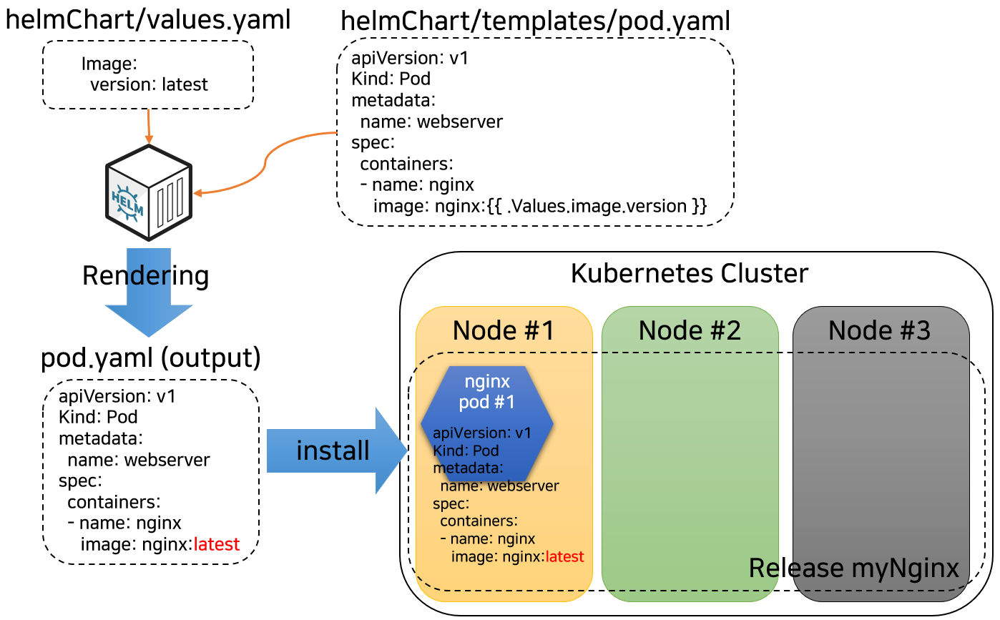
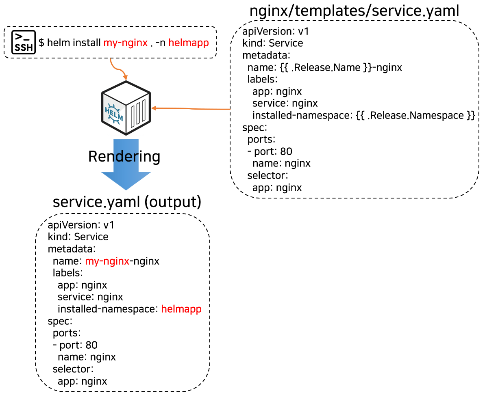
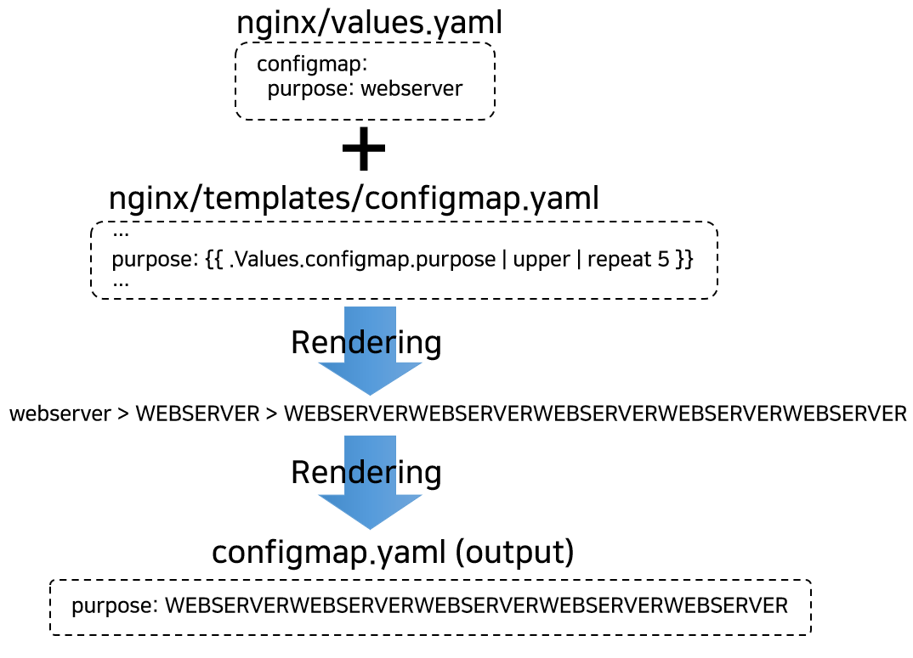
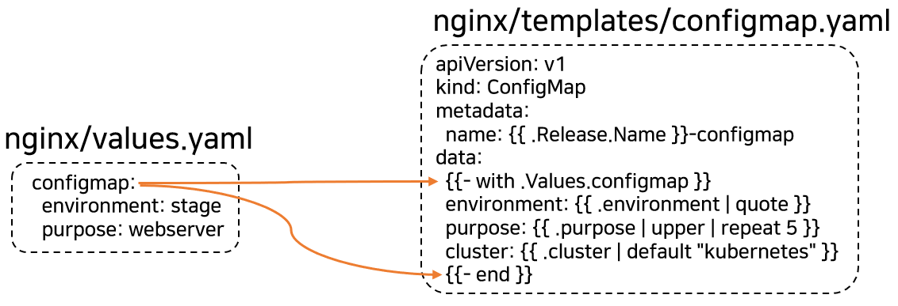
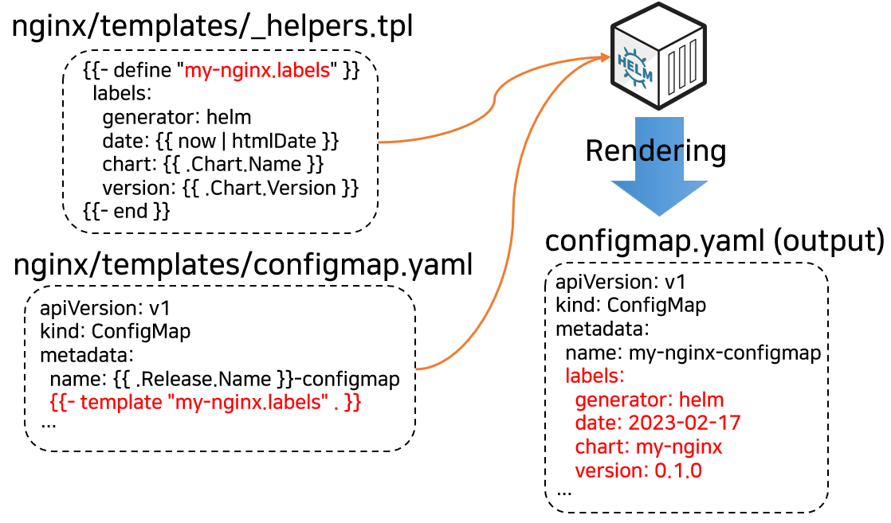

# 7일차 - Lab 1. Helm

> [!NOTE]
> 실습목표 : Helm에 대해 실습합니다.

---

- [7일차 - Lab 1. Helm]
  - [1. Helm](#1-helm)
  - [2. 기본 차트 생성](#2-기본-차트-생성)
  - [3. NOTES.txt](#3-notestxt)
  - [4. 빌트인 객체](#4-빌트인-객체)
  - [5. values.yaml](#5-valuesyaml)
  - [6. 명령어 우선순위](#6-명령어-우선순위)
  - [7. values.yaml 파일의 일반적인 계층 구조 적용](#7-values.yaml-파일의-일반적인-계층-구조-적용)
  - [8. 파이프라인을 이용한 순차 처리 적용](#8-파이프라인을-이용한-순차-처리-적용)
  - [9. 주로 사용되는 함수들 적용해보기](#9-주로-사용되는-함수들-적용해보기)
  - [10. if문과 toYaml 추가 적용해보기](#10-if문과-toyaml-추가-적용해보기)
  - [11. with : 변수 범위(scope)의 지정 제어](#11-with-변수-scope-지정-제어)
  - [12. loop 구조 적용해보기](#12-loop-구조-적용해보기)
  - [13. define template 적용해보기](#13-define-template-적용)
  - [14. Files 이용해서 다른 파일 내용 가져오기](#14-files-이용해서-다른-파일-내용-가져오기)
  - [15. 서브차트 적용해보기](#15-서브차트-적용해보기)
  - [16. 부모 차트에서 오버라이드](#16-부모-차트에서-오버라이드)
  - [17. Global value 정의하기](#17-global-value-정의하기)
  - [18. 템플릿 내에서 변수 정의](#18-템플릿-내에서-변수-정의)
  - [19. 실습에 사용된 오브젝트 정리](#19-실습에-사용된-오브젝트-정리)

---

## 1. Helm 

### 1-1. Helm 이란?

Helm : Kubernetes Package Managing Tool


- **Chart** : Helm의 package이며, 이 package에는 템플릿화된 Kubernetes Resource들을 담고 있음
- **Repository** : Chart(Kubernetes Package) 저장소
- **Release** : Kubernetes Cluster에서 구동되는 Chart의 Instance

  



  

Helm CLI 주요 명령어

> | 커맨드    | 설명                                                                  |
> | --------- | --------------------------------------------------------------------- |
> | create    | 주어진 이름으로 새 차트를 생성                                        |
> | lint      | 발생 가능한 문제에 대한 차트 검사                                     |
> | repo      | 차트 리포지토리 추가, 목록 조회, 제거, 업데이트 및 인덱스             |
> | search    | 차트에서 키워드 검색                                                  |
> | install   | 차트를 설치                                                           |
> | list      | 릴리즈 목록 조회                                                      |
> | upgrade   | 릴리즈 업그레이드                                                     |
> | rollback  | 릴리즈를 이전 버전으로 롤백                                           |
> | uninstall | 릴리즈 제거                                                           |
> | pull      | 리포지토리에서 차트를 다운로드하고 (선택적으로) 로컬 폴더에 압축 해제 |

  

Helm과 Operator의 차이  

- Helm은 여러 Kubernetes 리소스를 단일 패키지로 패키징하는 도구. (배포 및 업그레이드)  
- Operator는 커스텀 리소스를 포함한 여러 애플리케이션을 함께 패키징하고,  
  원하는 방식으로 동작하도록 능동적으로 관리하는 개념. (배포, 업그레이드, 운영관리)

    

---

    

## 2. 기본 차트 생성

### 2-1 Cloud9 접속

- 이번 실습은 Cloud9에서 진행합니다.

### 2-2 실습용 폴더 생성 및 이동

```bash
mkdir -p ~/environment/helm
```

```bash
cd ~/environment/helm
```

### 2-3. 환경변수 설정

- 나의 사번을 환경 변수로 설정합니다.
- <<사번>>을 나의 사번으로 변경후 명령어를 수행합니다.

```bash
export MY_ID=<<사번>>
```

- 예시 : `export MY_ID=33333`

### 2-4. 환경변수 확인

```bash
echo $MY_ID
```

- 결과 예시

```
mspmanager:~/environment $ echo $MY_ID
33333
```

### 2-5. 실습용 네임스페이스 생성

- MY_ID를 이용하여 namespace를 생성합니다.

```bash
kubectl create ns $MY_ID
```

### 2-5. nginx 차트 기본 템플릿 생성

```bash
helm create nginx
```

### 2-6. 확인

```bash
cd nginx
```

```bash
find .
```

### 2-7. 생성된 nginx 차트의 구조 설명

```bash
nginx/
  charts/                # 이 차트에 종속된 하위 차트들을 포함하는 폴더
  templates/             # 템플릿 파일들이 위치한 폴더. 헬름의 템플릿 렌더링 엔진의 처리결과가 K8s로 전달됨
  templates/NOTES.txt    # 차트의 "도움말". helm install 을 실행할 때 사용자에게 표시됨 (생략 가능)
  templates/_helpers.tpl # 차트 전체에서 다시 사용할 수 있는 템플릿 헬퍼를 지정하는 공간
  templates/*.yaml       # 샘플로 제공되는 K8s Manifest 템플릿 파일들
  .helmignore            # 헬름 차트에 포함시키고 싶지 않은 파일들을 지정 (helm package 명령시 이 파일에 지정된 파일들을 무시함)
  Chart.yaml             # 차트에 대한 설명 포함. 템플릿 안에서 접근할 수 있다.
  values.yaml            # 차트의 기본 환경설정 값들. helm install 또는 helm upgrade시 사용자가 재정의 가능
```

### 2-8. templates 디렉토리 내의 파일들을 모두 삭제

```bash
rm -rf templates/*
```

### 2-9. nginx service.yaml 파일 생성

- templates 디렉토리로 이동하여 각종 yaml을 생성합니다.

```bash
cd ~/environment/helm/nginx/templates
```

```bash
cat << EOF > service.yaml
---
apiVersion: v1
kind: Service
metadata:
  name: nginx
  labels:
    app: nginx
    service: nginx
spec:
  ports:
    - port: 80
      name: nginx
  selector:
    app: nginx
EOF
```

### 2-10. nginx deployment.yaml 파일 생성

```bash
cat << EOF > deployment.yaml
apiVersion: apps/v1
kind: Deployment
metadata:
  name: nginx
spec:
  replicas: 1
  selector:
    matchLabels:
      app: nginx
  template:
    metadata:
      labels:
        app: nginx
    spec:
      containers:
        - name: nginx
          image: nginx:latest
          imagePullPolicy: IfNotPresent
EOF
```

### 2-11. `Chart.yaml` 수정

- ~/environment/helm/nginx/Chart.yaml 파일을 아래와 같이 수정합니다.

```yaml
apiVersion: v2 # 차트 API 버전 (필수)
name: my-nginx # 차트명 (필수)
description: my nginx Helm chart for EKS # 이 프로젝트에 대한 간략한 설명 (선택)
type: application # 차트 타입 (선택)
keywords: # 이 프로젝트에 대한 키워드 리스트 (선택)
  - nginx
  - webserver
maintainers: # (선택)
  - name: T3 # 각 maintainer마다 필수
    email: T3@email.com # 각 maintainer마다 선택
    url: T3.com # 각 maintainer마다 선택
version: 0.1.0 # 차트의 버전, SemVer 표준 (필수)
appVersion: "1.0" # app의 버전 (선택)
```

- 참고 : SemVer : Major.Minor.Patch 형식

### 2-12. nginx 차트 설치

- 이 상태로 nginx 차트를 설치해본다.

```bash
cd ~/environment/helm/nginx
```

```bash
helm install my-nginx . -n $MY_ID
```

- (수행코드/결과 예시)

```bash
NAME: my-nginx
LAST DEPLOYED: Wed May 29 02:48:04 2024
NAMESPACE: 22222
STATUS: deployed
REVISION: 1
TEST SUITE: None
```

### 2-13. nginx 오브젝트 확인

- nginx 오브젝트들이 배포되었는지 확인해본다.

```bash
kubectl get all -n $MY_ID | grep nginx
```

```bash
helm ls -n $MY_ID
```

  

- (수행코드/결과 예시)

```bash
mspmanager:~/environment/nginx $ kubectl get all -n $MY_ID | grep nginx
pod/nginx-7f7499b7f6-kdklq   1/1     Running   0          53s
service/nginx   ClusterIP   10.100.79.228   <none>        80/TCP    54s
deployment.apps/nginx   1/1     1            1           54s
replicaset.apps/nginx-7f7499b7f6   1         1         1       54s
mspmanager:~/environment/nginx $ 
mspmanager:~/environment/nginx $ helm ls -n $MY_ID
NAME            NAMESPACE       REVISION        UPDATED                                 STATUS          CHART           APP VERSION
my-nginx        22222           1               2024-05-29 02:48:04.75636347 +0000 UTC  deployed        nginx-0.1.0     1.16.0     
```

### 2-14. helm uninstall

- 배포된 helm 릴리즈를 삭제하고 관련 오브젝트들이 제거되었는지 확인한다.

```bash
helm uninstall my-nginx -n $MY_ID
```

```bash
kubectl get all -n $MY_ID | grep nginx
```

- (수행코드/결과 예시)

```bash
mspmanager:~/environment/nginx $ helm uninstall my-nginx -n $MY_ID
release "my-nginx" uninstalled
mspmanager:~/environment/nginx $ kubectl get all -n $MY_ID | grep nginx
No resources found in 22222 namespace.
```

  

## 3. NOTES.txt

### 3-1. NOTES.txt 파일 생성

- ~/environment/helm/nginx/templates에 NOTES.txt 파일을 생성합니다.

```bash
cd ~/environment/helm/nginx
```

```bash
cat << EOF > templates/NOTES.txt
CAA 실습
helm 차트를 이용해 nginx를 설치했습니다.
EOF
```

### 3-2. 차트 설치

- 이 상태로 차트를 다시 설치해본다.

```bash
helm install -n $MY_ID my-nginx .
```

- (수행코드/결과 예시)

```
NAME: my-nginx
LAST DEPLOYED: Wed May 29 03:06:01 2024
NAMESPACE: 22222
STATUS: deployed
REVISION: 1
TEST SUITE: None
NOTES:
CAA 실습
helm 차트를 이용해 nginx를 설치했습니다.
```

### 3-3. 배포된 helm 릴리즈를 삭제한다.

```bash
helm uninstall -n $MY_ID my-nginx
```

  

## 4. 빌트인 객체

템플릿 엔진에서 템플릿으로 전달되는 빌트인 객체(Helm에서 기본 제공하는 객체)

### 4-1. templates/`service.yaml` 파일의 내용을 수정

- 아래와 같이 `service.yaml`을 수정합니다.

```yaml
---
apiVersion: v1
kind: Service
metadata:
  name: {{ .Release.Name }}-nginx  #변경
  labels:
    app: nginx
    service: nginx
    installed-namespace: "{{ .Release.Namespace }}"  #추가
spec:
  ports:
  - port: 80
    name: nginx
  selector:
    app: nginx
```

- 템플릿 지시문은 두개의 중괄호로 감싼다. (예시: **{{ .Release.Name }}** )
- 빌트인 객체의 첫 글자는 대문자로 시작한다.

### 4-2. templates/`NOTES.txt` 파일의 내용을 수정

- 아래와 같이 `NOTES.txt`을 수정합니다.

```
CAA 실습

helm 차트를 이용해 nginx를 설치했습니다.

Your release is named {{ .Release.Name }}.

삭제 하시려면 아래 명령어를 실행하세요.
$ helm uninstall {{ .Release.Name }} -n {{ .Release.Namespace }}
```

### 4-3. 차트 설치 해보기

```bash
helm install my-nginx . -n $MY_ID
```

- (수행코드/결과 예시)

```bash
NAME: my-nginx
LAST DEPLOYED: Wed May 29 06:43:41 2024
NAMESPACE: 22222
STATUS: deployed
REVISION: 1
TEST SUITE: None
NOTES:
CAA 실습

helm 차트를 이용해 nginx를 설치했습니다.

Your release is named my-nginx.

삭제 하시려면 아래 명령어를 실행하세요
```

### 4-3. 확인

- 배포된 helm 릴리즈 이름과 생성된 nginx 서비스 오브젝트 이름을 확인

```bash
helm ls -n $MY_ID
```

```bash
kubectl get svc -n $MY_ID
```

- (수행코드/결과 예시)

```bash
mspmanager:~/environment/nginx $ helm ls -n $MY_ID
NAME            NAMESPACE       REVISION        UPDATED                                 STATUS          CHART           APP VERSION
my-nginx        22222           1               2024-05-29 06:43:41.905283345 +0000 UTC deployed        nginx-0.1.0     1.16.0     
mspmanager:~/environment/nginx $ kubectl get svc -n $MY_ID
NAME             TYPE        CLUSTER-IP       EXTERNAL-IP   PORT(S)   AGE
my-nginx-nginx   ClusterIP   10.100.160.132   <none>        80/TCP    3h58m
```

### 4-4. nginx 서비스의 labels을 확인

```bash
kubectl get svc my-nginx-nginx -n $MY_ID -o jsonpath={.metadata.labels}
```

- (수행코드/결과 예시)

```bash
{"app":"nginx","app.kubernetes.io/managed-by":"Helm","installed-namespace":"22222","service":"nginx"}
```



### 4-5. 배포된 helm 릴리즈를 삭제

```bash
helm uninstall my-nginx -n $MY_ID
```

### 4-6. 빌트인 객체 종류

템플릿 엔진에서 템플릿으로 전달되는 빌트인 객체(Helm에서 기본 제공하는 객체) 종류

- Release : 이 객체는 릴리스 자체를 서술한다. 여러 객체를 가지고 있다.
  > | 객체명            | 설명                                                                                          |
  > | ----------------- | --------------------------------------------------------------------------------------------- |
  > | Release.Name      | 릴리스 이름                                                                                   |
  > | Release.Namespace | 릴리스될 네임스페이스 (manifest에서 오버라이드하지 않은 경우)                                 |
  > | Release.IsUpgrade | 현재 작업이 업그레이드 또는 롤백인 경우 true 로 설정된다.                                     |
  > | Release.IsInstall | 현재 작업이 설치일 경우 true 로 설정.                                                         |
  > | Release.Revision  | 이 릴리스의 리비전 번호. 설치시에는 이 값이 1이며 업그레이드나 롤백을 수행할 때마다 증가한다. |
  > | Release.Service   | 현재 템플릿을 렌더링하는 서비스. Helm 에서는 항상 Helm 이다.                                  |

  

- Values : `values.yaml` 파일 및 사용자 제공 파일에서 템플릿으로 전달된 값. (기본적으로 비어있음)
- Files: 차트 내의 모든 특수하지 않은(non-special) 파일에 대한 접근을 제공한다.  템플릿에 접근하는 데에는 사용할 수 없지만, 차트 내의 다른 파일에 접근하는 데에는 사용할 수 있다.
- Capabilities: 쿠버네티스 클러스터가 지원하는 기능에 대한 정보를 제공한다. (쿠버네티스 버전 등)
- Template: 실행 중인 현재 템플릿에 대한 정보를 포함한다.
  > | 객체명             | 설명                                                                 |
  > | ------------------ | -------------------------------------------------------------------- |
  > | Template.BasePath  | 현재 템플릿에 대한 파일 경로 (예: mychart/templates/mytemplate.yaml) |
  > | Template.Namespace | 현재 차트의 템플릿 폴더에 대한 경로 (예: mychart/templates)          |

  

## 5. values.yaml

- values.yaml 파일 변수 정의 및 템플릿에 적용

### 5-1. values.yaml 수정

- nginx/`values.yaml` 파일의 내용에 아래 내용 변경,추가합니다.

```yaml
#추가
environment: stage
#변경
replicaCount: 2
```

### 5-2. configmap.yaml 생성

```bash
cd ~/environment/helm/nginx
```

```bash
cat << EOF > templates/configmap.yaml
apiVersion: v1
kind: ConfigMap
metadata:
  name: {{ .Release.Name }}-configmap
data:
  environment: {{ .Values.environment }}
EOF
```

### 5-3. deployment.yaml 수정

- nginx/templates/`deployment.yaml` 파일 내용을 아래와 같이 수정합니다.

```
---
apiVersion: apps/v1
kind: Deployment
metadata:
  name: nginx
spec:
  replicas: {{ .Values.replicaCount }} ## 변경점
  selector:
    matchLabels:
      app: nginx
  template:
    metadata:
      labels:
        app: nginx
    spec:
      containers:
        - name: nginx
          image: nginx:latest
          imagePullPolicy: IfNotPresent
```

### 5-4. 차트 설치

```bash
helm install -n $MY_ID my-nginx .
```

  

### 5-5. nginx의 replica 갯수를 확인

```
kubectl get replicaset -n $MY_ID | head -1; kubectl get replicaset -n $MY_ID | grep nginx
```

  

### 5-6. 생성된 configmap의 data를 확인

```bash
kubectl get cm my-nginx-configmap -n $MY_ID -o yaml
```

- (수행코드/결과 예시)

```bash
apiVersion: v1
data:                 ## 이곳!
  environment: stage
kind: ConfigMap
metadata:
  annotations:
    meta.helm.sh/release-name: my-nginx
    meta.helm.sh/release-namespace: "22222"
  creationTimestamp: "2024-05-29T10:57:00Z"
  labels:
    app.kubernetes.io/managed-by: Helm
  name: my-nginx-configmap
  namespace: "22222"
  resourceVersion: "1227653"
  uid: 5ed2a0b5-611d-48cc-90c2-4d2b139e809a
```


### 5-7. 배포된 helm 릴리즈를 삭제

```bash
helm uninstall -n $MY_ID my-nginx
```

  

## 6. 명령어 우선순위

### 6-1. helm install 시 set 옵션을 이용해 value를 오버라이드

```bash
helm install -n $MY_ID my-nginx . --set environment=production
```

### 6-2. 생성된 configmap의 data를 확인

```bash
kubectl get cm my-nginx-configmap -n $MY_ID -o yaml
```

- (수행코드/결과 예시)

```bash
apiVersion: v1
data:
  environment: production      ## 이곳!
kind: ConfigMap
metadata:
  annotations:
    meta.helm.sh/release-name: my-nginx
    meta.helm.sh/release-namespace: default
  creationTimestamp: "2024-02-07T07:09:01Z"
  labels:
    app.kubernetes.io/managed-by: Helm
  name: my-nginx-configmap
  namespace: t3user998
  resourceVersion: "442101"
  uid: ccb816ac-4c76-44a9-ac0e-9758a8ff76c1
```

- --set 옵션을 이용해 `values.yaml`에 정의된 내용을 override 할 수 있다.


### 6-3. 🔥🔥🔥주의🔥🔥🔥

- 이번에는 `helm uninstall`하지 않습니다. 다음 실습과 이어집니다.

  

## 7. values.yaml 파일의 일반적인 계층 구조 적용

### 7-1. values.yaml 수정

- nginx/`values.yaml` 파일의 내용을 아래와 같이 계층구조로 수정 후 저장한다.

```yaml
configmap:
  environment: stage
  purpose: webserver

replicaCount: 1

image:
  name: nginx
  tag: latest
```

### 7-2. configmap.yaml 수정

- nginx/templates/`configmap.yaml` 파일 내용을 아래와 같이 수정 후 저장한다.

```yaml
---
apiVersion: v1
kind: ConfigMap
metadata:
  name: {{ .Release.Name }}-configmap
data:
  environment: {{ .Values.configmap.environment }} #변경
  purpose: {{ .Values.configmap.purpose }} #변경
```

### 7-3. deployment.yaml 수정

- nginx/templates/`deployment.yaml` 파일 내용을 아래와 같이 수정한다.

```yaml
---
apiVersion: apps/v1
kind: Deployment
metadata:
  name: nginx
spec:
  replicas: {{ .Values.replicaCount }}
  selector:
    matchLabels:
      app: nginx
  template:
    metadata:
      labels:
        app: nginx
    spec:
      containers:
      - name: nginx
        image: {{ .Values.image.name }}:{{ .Values.image.tag }} ## 변경
        imagePullPolicy: IfNotPresent
```

### 7-4. 차트 upgrade

```bash
helm upgrade -n $MY_ID my-nginx .
```

### 7-5. 릴리즈의 revision이 증가한 것을 확인한다.

```bash
helm ls -n $MY_ID
```

- (수행코드/결과 예시)

```bash
NAME            NAMESPACE       REVISION        UPDATED                                 STATUS          CHART           APP VERSION
my-nginx        22222           2               2024-05-29 11:11:24.986435154 +0000 UTC deployed        nginx-0.1.0     1.16.0  
```

### 7-6. configmap의 data를 확인

```bash
kubectl get cm my-nginx-configmap -n $MY_ID -o yaml
```

- (수행코드/결과 예시)

```bash
apiVersion: v1
data:
  environment: stage  #이곳!
  purpose: webserver  #이곳!
kind: ConfigMap
metadata:
  annotations:
    meta.helm.sh/release-name: my-nginx
    meta.helm.sh/release-namespace: "22222"
  creationTimestamp: "2024-05-29T11:10:07Z"
  labels:
    app.kubernetes.io/managed-by: Helm
  name: my-nginx-configmap
  namespace: "22222"
  resourceVersion: "1230606"
  uid: 3f5c3214-4b38-4716-83a0-730eb26d2a46
```

### 7-7. 설명

- `values.yaml` 파일만 수정하거나, 설치시 override 하거나, values 파일을 분리함으로써  
  하나의 Helm 차트만 가지고 여러 환경에 각기 다른 설정으로 배포할 수 있다.


  

## 8. 파이프라인을 이용한 순차 처리 적용

### 8-1. configmap.yaml 수정

- nginx/templates/`configmap.yaml` 파일 내용을 아래와 같이 수정 후 저장한다.

```yaml
---
apiVersion: v1
kind: ConfigMap
metadata:
  name: {{ .Release.Name }}-configmap
data:
  environment: {{ .Values.configmap.environment | quote }}
  purpose: {{ .Values.configmap.purpose | upper | repeat 5 }}  ## | upper | repeat 5 부분 추가
  cluster: {{ .Values.configmap.cluster | default "kubernetes" }}  ## 한줄 추가
```

### 8-2. 차트를 upgrade

```bash
helm upgrade -n $MY_ID my-nginx .
```

### 8-3. configmap의 data를 확인

```bash
kubectl get cm my-nginx-configmap -n $MY_ID -o yaml
```

- (수행코드/결과 예시)

```bash
apiVersion: v1
data:
  cluster: kubernetes ##여기!
  environment: stage
  purpose: WEBSERVERWEBSERVERWEBSERVERWEBSERVERWEBSERVER  ##여기!
kind: ConfigMap
metadata:
  annotations:
    meta.helm.sh/release-name: my-nginx
    meta.helm.sh/release-namespace: "22222"
  creationTimestamp: "2024-05-30T02:38:22Z"
  labels:
    app.kubernetes.io/managed-by: Helm
  name: my-nginx-configmap
  namespace: "22222"
  resourceVersion: "1435459"
  uid: 7a36a3a5-b529-4c65-a038-1e6a6c8ecba2
```

  



### 8-4.배포된 helm 릴리즈를 삭제한다.

```bash
helm uninstall -n $MY_ID my-nginx
```

  

## 9. 주로 사용되는 함수들 적용해보기

- if문 : 논리 및 흐름제어 함수 (if문)
- toYaml : 키에 해당하는 값 프린트
- indent : 주어진 문자열 들여쓰기
- `-` : 공백 제어

### 9-1. values.yaml 수정

- nginx/`values.yaml` 파일에 아래와 같이 수정

```yaml
configmap:
  environment: stage
  purpose: webserver

replicaCount: 1

image:
  name: nginx
  tag: latest

updateStrategy: ##추가
  type: RollingUpdate

podLabel: ##추가
  use: "yes"
```

### 9-2. deployment.yaml 수정

- nginx/templates/`deployment.yaml` 파일 내용을 아래와 같이 수정

```yaml
apiVersion: apps/v1
kind: Deployment
metadata:
  name: nginx
spec:
  replicas: {{ .Values.replicaCount }}
  {{- if .Values.updateStrategy }}                            ### if문 추가
  strategy: {{- toYaml .Values.updateStrategy | nindent 4 }}
  {{- end }}
  selector:
    matchLabels:
      app: nginx
  template:
    metadata:
      labels:
        app: nginx
        {{- if eq .Values.podLabel.use "yes" }}       ### if문 추가
        class: T3-CAA
        {{- else }}
        class: T3
        {{- end }}
        {{ if eq .Values.podLabel.use "yesyes" }}      ### if문 추가
        day: 5
        {{ else }}
        day: fifth
        {{ end }}
    spec:
      containers:
      - name: nginx
        image: {{ .Values.image.name }}:{{ .Values.image.tag }}
        imagePullPolicy: IfNotPresent
```

  

### 9-3. dry-run

- dry-run을 통해 deployment 템플릿 미리보기를 해본다.

```bash
helm install --dry-run my-nginx .
```

### 9-4. Deployment 템플릿에 적용된 내용을 확인

```yaml
# Source: my-nginx/templates/deployment.yaml
apiVersion: apps/v1
kind: Deployment
metadata:
  name: nginx
spec:
  replicas: 1
  strategy: ## updateStrategy value가 존재하기 때문에 템플릿에 추가됨
    type: RollingUpdate ## 줄바꾸기와 4칸 들여쓰기 적용됨 (nindent 4)
  selector:
    matchLabels:
      app: nginx
  template:
    metadata:
      labels:
        app: nginx
        class:
          T3-CAA ## podLabel.use 값이 "yes" 이기 때문에 'class: T3-CAA'가 템플릿에 추가됨
          ## 두번째 IF문인 템플릿 지시문에 하이픈(-)을 넣지 않았기 때문에 공백이 추가됨
        day:
          fifth ## podLabel.use 값이 "yesyes"가 아니기 때문에 'day: fifth'가 템플릿에 추가됨
          ## 템플릿 지시문에 하이픈(-)을 넣지 않았기 때문에 공백이 추가됨
    spec:
      containers:
        - name: nginx
          image: nginx:latest
          imagePullPolicy: IfNotPresent
```

- 논리 및 흐름제어 함수 예시  
  and, or, not, eq (equal, ==), ne (not equal, !=), lt (little, < ), le (little or equal, <=), gt (greater, >), ge (greater or equal, >=) 등  
  참조 <a href="https://helm.sh/ko/docs/chart_template_guide/function_list/">https://helm.sh/ko/docs/chart_template_guide/function_list/</a>

- {{- toYaml .Values.updateStrategy | nindent 4 }}   
  toYaml이라고 불리는 템플릿이 포함되어 있음. 이 템플릿은 .Values.updateStrategy의 값을 전달하고 그 출력 값을 파이프라인으로 연결된 nindent 함수에 전달함.

- indent 함수는 주어진 문자열의 모든 줄을 지정된 들여쓰기 너비로 들여쓴다. 이것은 여러 줄 문자열을 정렬할 때 유용하다.  
  nindent 함수는 indent 함수와 동일하지만 문자열 시작 부분에 새 줄을 추가한다.

  

## 10. if문과 toYaml 추가 적용해보기

### 10-1. values.yaml 수정

- nginx/`values.yaml` 파일에 아래와 같이 내용 추가 후 저장한다.

```yaml
configmap:
  environment: stage
  purpose: webserver

replicaCount: 1

image:
  name: nginx
  tag: latest

updateStrategy:
  type: RollingUpdate

podLabel:
  use: "yes"

nodeAffinity: ##추가
  enabled: true
  affinity:
    nodeAffinity:
      preferredDuringSchedulingIgnoredDuringExecution:
        - weight: 10
          preference:
            matchExpressions:
              - key: nodetype
                operator: In
                values:
                  - nginxserver
                  - webserver
```

### 10-2. deployment.yaml 수정

- nginx/templates/`deployment.yaml` 파일 내용을 아래와 같이 수정 후 저장한다.

```yaml
apiVersion: apps/v1
kind: Deployment
metadata:
  name: nginx
spec:
  replicas: {{ .Values.replicaCount }}
  {{- if .Values.updateStrategy }}
  strategy: {{- toYaml .Values.updateStrategy | nindent 4 }}
  {{- end }}
  selector:
    matchLabels:
      app: nginx
  template:
    metadata:
      labels:
        app: nginx
        {{- if eq .Values.podLabel.use "yes" }}
        class: T3-CTA
        {{- else }}
        class: T3
        {{- end }}
        {{ if eq .Values.podLabel.use "yesyes" }}
        day: 5
        {{ else }}
        day: fifth
        {{ end }}
    spec:
      {{- if .Values.nodeAffinity.enabled }}        ## 변경
      affinity:
        {{- toYaml .Values.nodeAffinity.affinity | nindent 8 }}
      {{- end }}
      containers:
      - name: nginx
        image: {{ .Values.image.name }}:{{ .Values.image.tag }}
        imagePullPolicy: IfNotPresent
```

### 10-3. dry-run을 통해 deployment 템플릿 미리보기

```bash
helm install --dry-run my-nginx .
```

### 10-4. 미리보기 한 내용 중, Deployment 템플릿에 적용된 내용을 확인

```yaml
apiVersion: apps/v1
kind: Deployment
metadata:
  name: nginx
spec:
  replicas: 1
  strategy:
    type: RollingUpdate
  selector:
    matchLabels:
      app: nginx
  template:
    metadata:
      labels:
        app: nginx
        class: T3-CAA

        day: fifth

    spec:
      affinity: ## nodeAffinity.enabled 가 true 이기 때문에 affinity 블록 추가됨
        nodeAffinity: ## values의 nodeAffinity.affinity 블록 전체를 8칸 들여쓰기로 가져옴
          preferredDuringSchedulingIgnoredDuringExecution:
            - preference:
                matchExpressions:
                  - key: nodetype
                    operator: In
                    values:
                      - nginxserver
                      - webserver
              weight: 10
      containers:
        - name: nginx
          image: nginx:latest
          imagePullPolicy: IfNotPresent
```

  

## 11. with 변수 scope 지정 제어

### 11-1. configmap.yaml 수정

- nginx/templates/`configmap.yaml` 파일 내용을 아래와 같이 수정 후 저장한다.

```yaml
---
apiVersion: v1
kind: ConfigMap
metadata:
  name: {{ .Release.Name }}-configmap
data:
  {{- with .Values.configmap }}     ## 수정
  environment: {{ .environment | quote }}
  purpose: {{ .purpose | upper | repeat 5 }}
  cluster: {{ .cluster | default "kubernetes" }}
  {{- end }}
```

### 11-2. dry-run을 통해 configmap 템플릿 미리보기를 해본다.

```bash
helm install --dry-run my-nginx .
```

- ## 기존과 동일하게 템플릿 생성됨

```yaml
apiVersion: v1
kind: ConfigMap
metadata:
  name: my-nginx-configmap
data:
  environment: "stage"
  purpose: WEBSERVERWEBSERVERWEBSERVERWEBSERVERWEBSERVER
  cluster: kubernetes
```

with를 사용하면 현재 범위(.)를 특정 객체로 설정할 수 있다.



### 11-3. configmap.yaml 수정

- nginx/templates/`configmap.yaml` 파일 내용을 아래와 같이 수정 후 저장한다.

```yaml
---
apiVersion: v1
kind: ConfigMap
metadata:
  name: {{ .Release.Name }}-configmap
data:
  {{- with .Values.configmap }}
  environment: {{ .environment | quote }}
  purpose: {{ .purpose | upper | repeat 5 }}
  cluster: {{ .cluster | default "kubernetes" }}
  releasename: {{ .Release.Name }}        #추가
  replicaCount: {{ .Values.replicaCount }}  #추가
  {{- end }}
```

### 11-4. dry-run을 통해 configmap 템플릿 미리보기를 해본다.

```bash
helm install --dry-run my-nginx .
```

- (수행코드/결과 예시)

```bash
Error: INSTALLATION FAILED: template: nginx/templates/configmap.yaml:11:26: executing "nginx/templates/configmap.yaml" at <.Release.Name>: nil pointer evaluating interface {}.Name
```

📌 with 블록 안의 범위(.)가 .Values.configmap으로 제한되었기 때문에 .Release 객체와 .Values 객체를 찾을 수 없어서 오류가 발생한다.

📌 제한된 범위 내에서는 상위 범위의 다른 객체에 액세스할 수 없다.

### 11-5. configmap.yaml 재수정

- nginx/templates/`configmap.yaml` 파일 내용을 아래와 같이 수정 후 저장한다.

```yaml
apiVersion: v1
kind: ConfigMap
metadata:
  name: {{ .Release.Name }}-configmap
data:
  {{- with .Values.configmap }}
  environment: {{ .environment | quote }}
  purpose: {{ .purpose | upper | repeat 5 }}
  cluster: {{ .cluster | default "kubernetes" }}
  {{- end }}
```

### 11-6. dry-run을 통해 오류가 나지 않음을 확인한다.

```bash
helm install --dry-run my-nginx .
```

  

## 12. loop 구조 적용해보기

### 12-1. values.yaml 수정

- nginx/`values.yaml` 파일에 아래와 같이 내용 추가 후 저장한다.

```yaml
configmap:
  environment: stage
  purpose: webserver
  arguments:
    - a
    - b
    - c
    - d
    - e

replicaCount: 1

image:
  name: nginx
  tag: latest

updateStrategy:
  type: RollingUpdate

podLabel:
  use: "yes"

nodeAffinity:
  enabled: true
  affinity:
    nodeAffinity:
      preferredDuringSchedulingIgnoredDuringExecution:
        - weight: 10
          preference:
            matchExpressions:
              - key: nodetype
                operator: In
                values:
                  - nginxserver
                  - webserver
```

### 12-2. configmap.yaml 수정

- nginx/templates/`configmap.yaml` 파일 내용을 아래와 같이 수정 후 저장한다.

```yaml
apiVersion: v1
kind: ConfigMap
metadata:
  name: {{ .Release.Name }}-configmap
data:
  {{- with .Values.configmap }}
  environment: {{ .environment | quote }}
  purpose: {{ .purpose | upper | repeat 5 }}
  cluster: {{ .cluster | default "kubernetes" }}
  {{- end }}
  args: |-
    {{- range .Values.configmap.arguments }}
    - {{ . | quote }}
    {{- end}}
```

- YAML의 |- 마커는 여러 줄 문자열을 사용 선언. 이것은 매니페스트 내부에 큰 데이터 블록을 포함하는 데 유용하다.

### 12-3. dry-run을 통해 configmap 템플릿 미리보기를 해본다.

```bash
helm install --dry-run my-nginx .
```

Range는 for-each문 처럼 작동한다. (배열의 크기만큼 루프를 돌면서 각 원소를 순차적으로 접근)

```yaml
## values.yaml
configmap:
  environment: stage
  purpose: webserver
  arguments:
    - a
    - b
    - c
    - d
    - e

## 헬름 템플릿
args: |-
  {{- range .Values.configmap.arguments }}
  - {{ . | quote }}
  {{- end}}

## 생성된 템플릿
apiVersion: v1
kind: ConfigMap
metadata:
  name: my-nginx-configmap
data:
  environment: "stage"
  purpose: WEBSERVERWEBSERVERWEBSERVERWEBSERVERWEBSERVER
  cluster: kubernetes
  args: |- ## .Values.configmap.arguments 배열의 값들을 한줄씩 출력 해준다.
    - "a"
    - "b"
    - "c"
    - "d"
    - "e"
```

  

## 13. define template 적용

- define : 모든 템플릿에서 액세스 할 수 있는 Helper template 정의하기

- 이름이 밑줄(\_)로 시작하는 파일은 내부에 매니페스트가 없는 것으로 간주된다.  
  이러한 파일은 Kubernetes 오브젝트 메니페스트로 렌더링되지 않지만, 다른 차트 템플릿 내의 모든 위치에서 사용할 수 있다.

### 13-1. 헬퍼 템플릿 파일을 생성한다.

```bash
cat << EOF > templates/_helpers.tpl
{{- define "my-nginx.labels" }}
  labels:
    generator: helm
    date: {{ now | htmlDate }}
    chart: {{ .Chart.Name }}
    version: {{ .Chart.Version }}
{{- end }}
EOF
```

### 13-2. configmap.yaml 수정

- nginx/templates/`configmap.yaml` 파일 내용을 아래와 같이 수정 후 저장한다.

```yaml
apiVersion: v1
kind: ConfigMap
metadata:
  name: {{ .Release.Name }}-configmap
  {{- template "my-nginx.labels" . }}  ## 추가
data:
  {{- with .Values.configmap }}
  environment: {{ .environment | quote }}
  purpose: {{ .purpose | upper | repeat 5 }}
  cluster: {{ .cluster | default "kubernetes" }}
  {{- end }}
  args: |-
    {{- range .Values.configmap.arguments }}
    - {{ . | quote }}
    {{- end}}
```

### 13-3. dry-run을 통해 configmap 템플릿 미리보기를 해본다.

```bash
helm install --dry-run my-nginx .
```

### 13-4. 적용된 내용을 확인해본다.

```yaml
apiVersion: v1
kind: ConfigMap
metadata:
  name: my-nginx-configmap
  labels: ## _helpers.tpl 파일에 정의된 my-nginx.labels 블록이 적용되어 있다.
    generator: helm
    date: 2023-06-01 ## 날짜 함수가 사용 가능하다.
    chart: my-nginx ## Chart.yaml의 값을 가져올 수 있다.
    version: 0.1.0
data:
  environment: "stage"
  purpose: WEBSERVERWEBSERVERWEBSERVERWEBSERVERWEBSERVER
  cluster: kubernetes
  args: |-
    - "a"
    - "b"
    - "c"
    - "d"
    - "e"
```

tpl 파일에 정의된 내용을 재사용 할 수 있다.



  

## 14. Files 이용해서 다른 파일 내용 가져오기

- 이전 항목에서 헬퍼 템플릿을 만들고 액세스하는 몇 가지 방법을 살펴보았다.
- 이런 방법으로 다른 템플릿에서 필요한 헬퍼 템플릿을 쉽게 가져올 수 있다.
- 하지만 때로는 헬퍼 템플릿이 아닌 파일을 가져와서 그 내용을 템플릿 렌더러(renderer)로 보내지 않고 직접 주입(inject)하려고 하는 경우가 있을 수 있다.

  

### 14-1. files 디렉토리 생성

```bash
mkdir -p ~/environment/helm/nginx/files
```

### 14-2. config1.yaml 생성

```bash
cat << EOF > files/config1.yaml
message = Hello from config 1
EOF
```

### 14-3. config2.yaml 생성

```bash
cat << EOF > files/config2.yaml
configval1: "1"
configval2: "2"
configval3: "3"
EOF
```

### 14-4. secret yaml 파일을 생성

```bash
cat << EOF > templates/secret.yaml
apiVersion: v1
kind: Secret
metadata:
  name: {{ .Release.Name }}-secret
type: Opaque
data:
  token: |-
        {{ .Files.Get "files/config1.yaml" | b64enc }}
EOF
```

### 14-5. configmap.yaml 수정

- nginx/templates/`configmap.yaml` 파일 내용을 아래와 같이 수정 후 저장한다.

```yaml
apiVersion: v1
kind: ConfigMap
metadata:
  name: {{ .Release.Name }}-configmap
  {{- template "my-nginx.labels" . }}
data:
  {{- with .Values.configmap }}
  environment: {{ .environment | quote }}
  purpose: {{ .purpose | upper | repeat 5 }}
  cluster: {{ .cluster | default "kubernetes" }}
  {{- end }}
  args: |-
    {{- range .Values.configmap.arguments }}
    - {{ . | quote }}
    {{- end}}
{{ .Files.Get "files/config2.yaml" | trim | indent 2 }}  ##추가
```

### 14-6. dry-run 통해 template 미리 확인

```bash
helm install --dry-run my-nginx .
```

### 14-7. configmap의 데이터를 확인해본다.

- (수행코드/결과 예시)

```bash
---
# Source: nginx/templates/configmap.yaml
apiVersion: v1
kind: ConfigMap
metadata:
  name: my-nginx-configmap
  labels:
    generator: helm
    date: 2024-06-01
    chart: nginx
    version: 0.1.0
data:
  environment: "stage"
  purpose: WEBSERVERWEBSERVERWEBSERVERWEBSERVERWEBSERVER
  cluster: kubernetes
  args: |-
    - "a"
    - "b"
    - "c"
    - "d"
    - "e"
  configval1: "1"
  configval2: "2"
  configval3: "3"  ##추가
```

### 14-8. secret의 데이터를 확인해본다.


- (수행코드/결과 예시)

```bash
---
# Source: nginx/templates/secret.yaml
apiVersion: v1
kind: Secret
metadata:
  name: my-nginx-secret
type: Opaque
data:
  token: |-
        bWVzc2FnZSA9IEhlbGxvIGZyb20gY29uZmlnIDEK
```

### 14-9. secret의 data에 저장된 token value를 decode 해본다.

```bash
echo bWVzc2FnZSA9IEhlbGxvIGZyb20gY29uZmlnIDEK= | base64 --decode ; echo
```


### 14-10. 참고

- 어떤 파일은 .Files 객체를 통해 액세스할 수 없는데, 주로 보안 상의 이유 때문이다.
- templates/에 있는 파일은 액세스할 수 없다.
- .helmignore에 기재되어 제외된 파일은 액세스할 수 없다.

  

## 15. 서브차트 적용해보기


### 15-1. 서브 차트 생성

- 서브차트를 생성하고, 안에 자동 생성되는 샘플 파일을 모두 삭제한다.

```bash
cd ~/environment/helm/nginx/charts/
```

```bash
helm create subnginx
```

```bash
rm -rf subnginx/templates/*
```

```bash
cd ..
```

### 15-2. 서브 차트의 values.yaml 수정

- 서브차트인 nginx/charts/subnginx 폴더의 `values.yaml` 파일 내용을 아래로 교체한 후 저장한다.

```
configmap:
  environment: prod
```

### 15-3. 서브 차트에 템플릿 파일을 생성한다.

```bash
cat << EOF > charts/subnginx/templates/subconfigmap.yaml
---
apiVersion: v1
kind: ConfigMap
metadata:
  name: {{ .Release.Name }}-subchart-configmap
  {{- template "my-nginx.labels" . }}
data:
  environment: {{ .Values.configmap.environment | quote }}
EOF
```

### 15-4. 부모 차트를 설치

```bash
helm install -n $MY_ID my-nginx .
```

### 15-5. 서브차트의 configmap의 data에서 environment 값을 확인해본다.

```bash
kubectl get cm my-nginx-subchart-configmap -n $MY_ID -o yaml
```

- (수행코드/결과 예시)

```bash
apiVersion: v1
data:
  environment: prod
kind: ConfigMap
metadata:
  annotations:
    meta.helm.sh/release-name: my-nginx
    meta.helm.sh/release-namespace: "22222"
  creationTimestamp: "2024-06-01T06:55:36Z"
  labels:
    app.kubernetes.io/managed-by: Helm
    chart: subnginx
    date: "2024-06-01"
    generator: helm
    version: 0.1.0
  name: my-nginx-subchart-configmap
  namespace: "22222"
  resourceVersion: "2030426"
  uid: eb53293a-be53-443b-acce-f254ddf5a639
```

  

## 16. 부모 차트에서 오버라이드

### 16-1. 부모차트 values.yaml 수정

- 부모차트인 nginx/`values.yaml` 파일에 아래와 같이 내용 추가 후 저장한다.

```yaml
configmap:
  environment: stage
  purpose: webserver
  arguments:
    - a
    - b
    - c
    - d
    - e

subnginx: ##추가
  configmap:
    environment: develop

replicaCount: 1

image:
  name: nginx
  tag: latest

updateStrategy:
  type: RollingUpdate

podLabel:
  use: "yes"

nodeAffinity:
  enabled: true
  affinity:
    nodeAffinity:
      preferredDuringSchedulingIgnoredDuringExecution:
        - weight: 10
          preference:
            matchExpressions:
              - key: nodetype
                operator: In
                values:
                  - nginxserver
                  - webserver
```

### 16-2. 차트 upgrade

```bash
helm upgrade -n $MY_ID my-nginx .
```

### 16-3. 서브차트의 configmap의 data에서 environment 값을 확인

```bash
kubectl get cm my-nginx-subchart-configmap -n $MY_ID -o yaml
```

**(수행코드/결과 예시)**

```bash
apiVersion: v1
data:
  environment: develop       ## 아까와 값이 다르게 적용되었다.
kind: ConfigMap
metadata:
  annotations:
    meta.helm.sh/release-name: my-nginx
    meta.helm.sh/release-namespace: "22222"
  creationTimestamp: "2024-06-01T06:55:36Z"
  labels:
    app.kubernetes.io/managed-by: Helm
    chart: subnginx
    date: "2024-06-01"
    generator: helm
    version: 0.1.0
  name: my-nginx-subchart-configmap
  namespace: "22222"
  resourceVersion: "2030874"
  uid: eb53293a-be53-443b-acce-f254ddf5a639
```

- 부모 차트의 `values.yaml`에 정의된 subnginx.configmap.environment의 값인 develop가 적용되어있다.

  

## 17. Global value 정의하기

모든 차트, 서브차트에서 같은 이름으로 액세스 할 수 있는 글로벌 차트 value를 정의해본다.

### 17-1. 부모차트 values.yaml 수정

- 부모차트인 nginx/`values.yaml` 파일에 아래와 같이 내용 추가 후 저장한다.

```yaml
global:
  configmap:
    environment: confused

configmap:
  environment: stage
  purpose: webserver
  arguments:
    - a
    - b
    - c
    - d
    - e

subnginx:
  configmap:
    environment: develop

replicaCount: 1

image:
  name: nginx
  tag: latest

updateStrategy:
  type: RollingUpdate

podLabel:
  use: "yes"

nodeAffinity:
  enabled: true
  affinity:
    nodeAffinity:
      preferredDuringSchedulingIgnoredDuringExecution:
        - weight: 10
          preference:
            matchExpressions:
              - key: nodetype
                operator: In
                values:
                  - nginxserver
                  - webserver
```

### 17-2. 서브 subconfigmap.yaml 수정

- 서브차트의 nginx/charts/subnginx/templates/subconfigmap.yaml 파일 내용을 아래와 같이 수정한다.

```yaml
apiVersion: v1
kind: ConfigMap
metadata:
  name: {{ .Release.Name }}-subchart-configmap
  {{- template "my-nginx.labels" . }}
data:
  environment: {{ .Values.global.configmap.environment | quote }}  ## global 추가
```

### 17-3.차트를 upgrade

```bash
helm upgrade -n $MY_ID my-nginx .
```

### 17-4. 서브차트의 configmap의 data에서 environment 값을 확인해본다.

```bash
kubectl get cm my-nginx-subchart-configmap -n $MY_ID -o yaml
```

- (수행코드/결과 예시)

```bash
apiVersion: v1
data:
  environment: confused     ## 아까와 다른 값이 적용 되어있다.
kind: ConfigMap
metadata:
  annotations:
    meta.helm.sh/release-name: my-nginx
    meta.helm.sh/release-namespace: "22222"
  creationTimestamp: "2024-06-01T06:55:36Z"
  labels:
    app.kubernetes.io/managed-by: Helm
    chart: subnginx
    date: "2024-06-01"
    generator: helm
    version: 0.1.0
  name: my-nginx-subchart-configmap
  namespace: "22222"
  resourceVersion: "2031528"
  uid: eb53293a-be53-443b-acce-f254ddf5a639
```

- 부모 차트의 values.yaml에 정의된 global.configmap.environment의 값인 confused가 적용되어있다.
- 부모 차트의 global로 정의된 객체는 모든 하위 차트의 템플릿에서 액세스 할 수 있다.

  

## 18. 템플릿 내에서 변수 정의

### 18-1. 서브차트 subconfigmap.yaml 수정

- 서브차트의 nginx/charts/subnginx/templates/subconfigmap.yaml 파일 내용을 아래와 같이 수정한다.

```yaml
{{- $env := .Values.global.configmap.environment | quote -}}
apiVersion: v1
kind: ConfigMap
metadata:
  name: {{ .Release.Name }}-subchart-configmap
  {{- template "my-nginx.labels" . }}
data:
  environment: {{ $env }}
```

### 18-2. 차트를 upgrade 해본다.

```bash
helm upgrade my-nginx -n $MY_ID .
```

### 18-3. 서브차트의 configmap의 data에서 environment 값을 확인해본다.

```bash
kubectl get cm my-nginx-subchart-configmap -n $MY_ID -o yaml
```

- (수행코드/결과 예시)

```bash
ubuntu@ip-10-2-10-163:~/k8s-helm/nginx$ kubectl get cm my-nginx-subchart-configmap -n $MY_ID -o yaml
apiVersion: v1
data:
  environment: confused   ## 템플릿 내에서 정의한 변수인 $env의 값(.Values.global.configmap.environment)이 적용되어있다.
kind: ConfigMap
metadata:
  annotations:
    meta.helm.sh/release-name: my-nginx
    meta.helm.sh/release-namespace: "22222"
  creationTimestamp: "2024-06-01T06:55:36Z"
  labels:
    app.kubernetes.io/managed-by: Helm
    chart: subnginx
    date: "2024-06-01"
    generator: helm
    version: 0.1.0
  name: my-nginx-subchart-configmap
  namespace: "22222"
  resourceVersion: "2031528"
  uid: eb53293a-be53-443b-acce-f254ddf5a639
```

  

## 19. 실습에 사용된 오브젝트 정리

```bash
helm uninstall -n $MY_ID my-nginx
```

