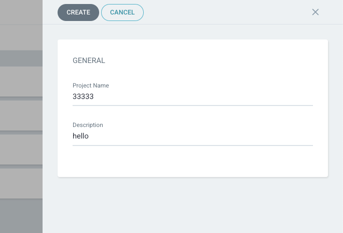
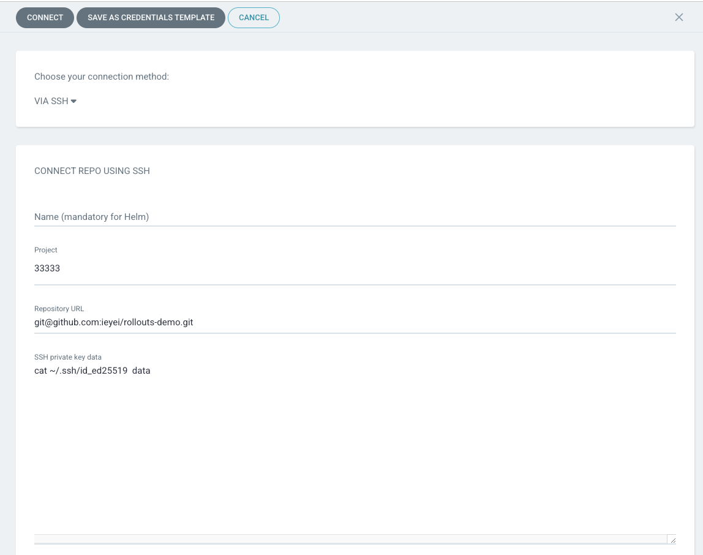
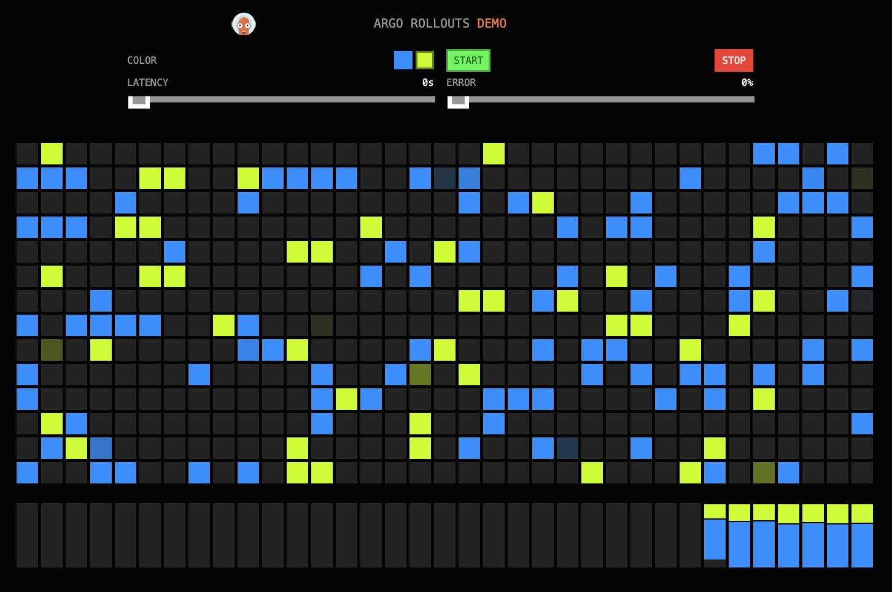
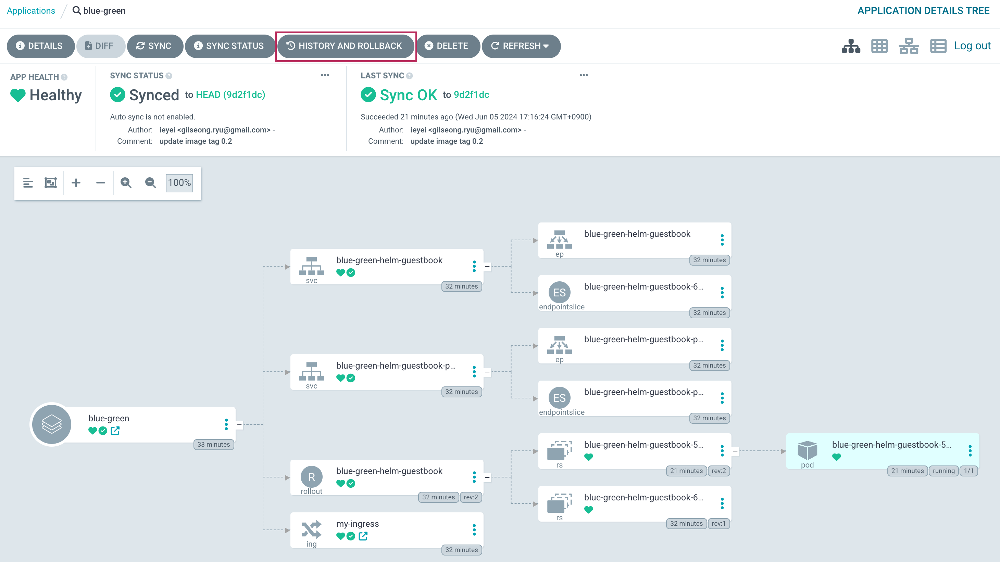

# 7일차 - Lab 2. Application 배포 - Canary Deploy

> [!NOTE]
> 실습목표 : ArgoCD와 Rollout을 이용하여 Application 배포에 대해 실습합니다.

---

- [7일차 - Lab 2. Application 배포]
  - [0. 환경 설정](#0-환경-설정)
  - [1. argocd 접속](#1-argocd-접속)
  - [2. Cloud9 Git config](#2-cloud9-git-config)
  - [3. Rollout code 생성](#3-Rollout-code-생성)
  - [4. Code Push](#4-Code-Push)
  - [5. Argocd Project 등록](#5-argocd-project-등록)
  - [6. Argocd Repository 등록](#6-argocd-repository-등록)
  - [7. Argocd Application 등록](#7-argocd-application-등록)
  - [8. Argo Rollout - Canary 배포](#8-Argo-Rollout-Canary-배포)

---


## 0. 환경 설정

### 0-1. 환경변수 설정

- 나의 사번을 환경 변수로 설정합니다.
- <<사번>>를 나의 사번으로 변경후 명령어를 수행합니다.

```bash
export MY_ID=<<사번>>
```

- 예시 : `export MY_ID=33333`

### 0-2. 환경변수 확인

```bash
echo $MY_ID
```

- 결과 예시

```
mspmanager:~/environment $ echo $MY_ID
22222
```

### 0-3. namespace 생성

```bash
kubectl create ns $MY_ID
```

### 0-4. kubeconfig context 설정 
```bash
kubectl config set-context --current --namespace $MY_ID
```

<br>

## 1. argocd 접속

### 1-1. argocd 접속

- 브라우저에 `argocd ui address` 를 입력하여 페이지를 확인합니다. 


### 1-2. argocd 접속 확인

- Username : admin
- Password : xxxxx


<details>
<summary> 😎 [참고 - 펼치기👇] 만약 비밀번호가 xxxxx이 아니라면</summary>

<br>

- k8s의 secret을 통해 비밀번호를 얻습니다.

- 아래 명령어를 cloud9에서 수행하여 argocd의 password을 얻습니다.

```bash
kubectl -n argocd get secret argocd-initial-admin-secret -o jsonpath="{.data.password}" | base64 -d; echo
```

</details>

<br>


## 2. Cloud9 Git config

- 아래 명령어를 입력하여 cloud9의 git config 설정을 합니다.

```bash
git config --global user.email "<<나의 깃헙 계정 email>>"
```

```bash
git config --global user.name "<<나의 깃헙 username>>"
```


<br>

## 3. Rollout code 생성

### 3-1. Github Repository 생성

- 자신의 Github에 `rollouts-demo`라는 이름의 Repository를 생성합니다.


** [입력]**

> | 항목               | 내용            | 액션                |
> | ------------------ | --------------- | ------------------- |
> | ➕ Repository name | `rollouts-demo` | Copy & Paste |
> | ➕ 공개여부        | `Private`       | 라디오버튼 선택   |
> | ➕ README        | `Add a README file`       | Check   |

- `Create repository` 클릭

### 3-2. repo url 설정

```bash
export ROLLOUTS_DEMO_URL="<< my github repo url >>"
```

### 3-3. Clone

- 디렉토리로 이동

```bash
cd ~/environment
```

- git clone

```bash
git clone $ROLLOUTS_DEMO_URL
```


- clone 받은 디렉토리로 이동

```bash
cd rollouts-demo
mkdir canary
cd canary
```


### 3-4. rollouts-demo 생성


- ingress.yaml 생성

```bash
cat << EOF > ingress.yaml
apiVersion: networking.k8s.io/v1
kind: Ingress
metadata:
  name: rollouts-demo-ingress
  annotations:
    kubernetes.io/ingress.class: alb
    alb.ingress.kubernetes.io/scheme: internet-facing
    alb.ingress.kubernetes.io/target-type: ip
spec:
  rules:
  - http:
      paths:
      - path: /
        pathType: Prefix
        backend:
          service:
            name: rollouts-demo-root
            port:
              name: use-annotation
EOF
```

- service.yaml 생성

```bash
cat << EOF > service.yaml
apiVersion: v1
kind: Service
metadata:
  name: rollouts-demo-root
spec:
  type: NodePort
  ports:
  - port: 80
    targetPort: http
    protocol: TCP
    name: http
  selector:
    app: rollouts-demo

---
apiVersion: v1
kind: Service
metadata:
  name: rollouts-demo-canary
spec:
  type: NodePort
  ports:
  - port: 80
    targetPort: http
    protocol: TCP
    name: http
  selector:
    app: rollouts-demo
    # This selector will be updated with the pod-template-hash of the canary ReplicaSet. e.g.:
    # rollouts-pod-template-hash: 7bf84f9696

---
apiVersion: v1
kind: Service
metadata:
  name: rollouts-demo-stable
spec:
  type: NodePort
  ports:
  - port: 80
    targetPort: http
    protocol: TCP
    name: http
  selector:
    app: rollouts-demo
    # This selector will be updated with the pod-template-hash of the stable ReplicaSet. e.g.:
    # rollouts-pod-template-hash: 789746c88d
EOF
```

- rollout.yaml

```bash
cat << EOF > rollout.yaml
apiVersion: argoproj.io/v1alpha1
kind: Rollout
metadata:
  name: rollouts-demo
spec:
  replicas: 1
  strategy:
    canary:
      canaryService: rollouts-demo-canary
      stableService: rollouts-demo-stable
      trafficRouting:
        alb:
          ingress: rollouts-demo-ingress
          servicePort: 80
          rootService: rollouts-demo-root
      steps:
      - setWeight: 5
      - pause: {}
  revisionHistoryLimit: 2
  selector:
    matchLabels:
      app: rollouts-demo
  template:
    metadata:
      labels:
        app: rollouts-demo
    spec:
      containers:
      - name: rollouts-demo
        image: argoproj/rollouts-demo:blue
        ports:
        - name: http
          containerPort: 8080
          protocol: TCP
        resources:
          requests:
            memory: 32Mi
            cpu: 5m
EOF
```


## 4. Code Push

```bash
git add .

git commit -m "first commit"

git push

```

## 5. Argocd Project 등록

### 5-1. Projects 페이지 이동

- `Argocd 페이지` > `Settings` > `Projects`

### 5-2. Projects 등록 페이지 이동

- `NEW PROJECTS` 클릭

### 5-3. Projects 등록

** [입력]**

> | 항목            | 내용            | 액션                                |
> | --------------- | --------------- | ----------------------------------- |
> | ➕ Project Name | `<<사번>>`      | 본인의 사번을 넣습니다. 예시: 33333 |
> | ➕ Description  | `<<본인 이름>>` | 각자의 이름을 넣습니다.             |




- 입력후 `Connect` 클릭

### 5-4. Destinations 추가

- 생성된 project 클릭 하여 상세 보기화면으로 이동
- `Destinations`의 `Edit` 클릭
- `ADD DESTINATION` 클릭
- `SAVE` 클릭

## 6. Argocd Repository 등록

### 6-1. Repository 페이지 이동

- `Argocd 페이지` > `Settings` > `Repositories`


### 6-2. Repository 등록 페이지 이동

- `CONNECT REPO` 클릭

### 6-3. Repository 등록

** [입력]**

> | 항목                              | 내용                            | 액션                                   |
> |---------------------------------|-------------------------------| -------------------------------------- |
> | ➕ Choose your connection method | `VIA SSH`                     | 드롭박스 선택                        |
> | ➕ Project                       | `<<나의 Project>>`              | 윗챕터에서 만든 프로젝트를 선택합니다. |
> | ➕ Repository URL                | `<<rollouts-demo repo의 url>>` | Copy & Paste                    |
> | ➕ SSH private key data          | `SSH private key`              | Copy & Paste                    |

SSH private key data 항목에는 다음 결과를 붙인다.
```bash
cat ~/.ssh/id_ed25519
```



- 입력후 `Connect` 클릭

### 6-4. Repository 등록 확인


<br>

## 7. Argocd Application 등록

### 7-1. Application 등록 페이지 이동

- 생성된 Repository의 `...`버튼 클릭 > `Create application` 클릭


### 7-2. Application 등록

** [입력]**

> | 항목                         | 내용                             | 액션                                   |
> | ---------------------------- | -------------------------------- | -------------------------------------- |
> | ➕ Application Name          | `rollouts-demo-<<사번>>`                  | Copy & Paste                    |
> | ➕ Project Name              | `<<나의 Project>>`               | 윗챕터에서 만든 프로젝트를 선택합니다. |
> | ➕ SOURCE > Repo url         | `<<rollouts-demo repo url>>`     | 드롭박스 선택                        |
> | ➕ SOURCE > Path             | `.`                              | Copy & Paste                    |
> | ➕ DESTINATION > Cluster URL | `https://kubernetes.default.svc` | 드롭박스 선택                        |
> | ➕ DESTINATION > Namespace   | `<<사번>>`                       | Copy & Paste                    |


- 입력후 `Create`

### 7-3. Application 등록 확인

- 오른쪽 프로젝트에서 나의 프로젝트를 필터링 합니다.


### 7-4. Sync

- `SYNC` > `SYNCHRONIZE` 버튼을 클릭하여 Sync 합니다.


### 7-5. Sync 확인


rollout 확인
```bash
$ kubectl argo rollouts get rollout rollouts-demo -n $MY_ID
Name:            rollouts-demo
Namespace:       33333
Status:          Healthy
Strategy:        Canary
  Step:          2/2
  SetWeight:     100
  ActualWeight:  100
Images:          argoproj/rollouts-demo:blue (stable)
Replicas:
  Desired:       1
  Current:       1
  Updated:       1
  Ready:         1
  Available:     1

NAME                                       KIND        STATUS     AGE  INFO
⟳ rollouts-demo                            Rollout     Healthy  11m  
└──# revision:1                                                        
   └──⧉ rollouts-demo-687d76d795           ReplicaSet  Healthy  11m  stable
      └──□ rollouts-demo-687d76d795-7tbjl  Pod         Running  11m  ready:1/1
```
<br>

### 7-6. 페이지 확인

```bash
kubectl get ing -n $MY_ID
```


<br>

## 8. Argo Rollout Canary 배포

rollout.yaml 변경
```yaml
apiVersion: argoproj.io/v1alpha1
kind: Rollout
metadata:
  name: rollouts-demo
spec:
  replicas: 3  #update
  strategy:
    canary:
      canaryService: rollouts-demo-canary
      stableService: rollouts-demo-stable
      trafficRouting:
        alb:
          ingress: rollouts-demo-ingress
          servicePort: 80
          rootService: rollouts-demo-root
      steps:
      - setWeight: 30 #update
      - pause: {}
  revisionHistoryLimit: 2
  selector:
    matchLabels:
      app: rollouts-demo
  template:
    metadata:
      labels:
        app: rollouts-demo
    spec:
      containers:
      - name: rollouts-demo
        image: argoproj/rollouts-demo:yellow #update
        ports:
        - name: http
          containerPort: 8080
          protocol: TCP
        resources:
          requests:
            memory: 32Mi
            cpu: 5m

```
git push
```bash
git add .
git commit -m "image update"
git push
```
argocd ui 에서 sync

cloud9에서 rollout 확인
```bash
mspmanager:~/environment/chart/rollouts-demo (main) $ kubectl argo rollouts get rollout rollouts-demo -n $MY_ID
Name:            rollouts-demo
Namespace:       33333
Status:          ॥ Paused
Message:         CanaryPauseStep
Strategy:        Canary
  Step:          1/2
  SetWeight:     30
  ActualWeight:  30
Images:          argoproj/rollouts-demo:blue (stable)
                 argoproj/rollouts-demo:yellow (canary)
Replicas:
  Desired:       3
  Current:       4
  Updated:       1
  Ready:         4
  Available:     4

NAME                                       KIND        STATUS     AGE    INFO
⟳ rollouts-demo                            Rollout     ॥ Paused   28m    
├──# revision:2                                                          
│  └──⧉ rollouts-demo-6cf78c66c5           ReplicaSet  Healthy  2m50s  canary
│     └──□ rollouts-demo-6cf78c66c5-lctwt  Pod         Running  2m50s  ready:1/1
└──# revision:1                                                          
   └──⧉ rollouts-demo-687d76d795           ReplicaSet  Healthy  28m    stable
      ├──□ rollouts-demo-687d76d795-7tbjl  Pod         Running  28m    ready:1/1
      ├──□ rollouts-demo-687d76d795-b8kdz  Pod         Running  2m50s  ready:1/1
      └──□ rollouts-demo-687d76d795-krlhq  Pod         Running  2m50s  ready:1/1
```

화면에서 확인합니다.


Promote
```bash
mspmanager:~/environment/chart/rollouts-demo (main) $ kubectl argo rollouts promote rollouts-demo -n $MY_ID                             
rollout 'rollouts-demo' promoted
mspmanager:~/environment/chart/rollouts-demo (main) $ kubectl argo rollouts get rollout rollouts-demo -n $MY_ID
Name:            rollouts-demo
Namespace:       33333
Status:          Healthy
Strategy:        Canary
  Step:          2/2
  SetWeight:     100
  ActualWeight:  100
Images:          argoproj/rollouts-demo:yellow (stable)
Replicas:
  Desired:       3
  Current:       3
  Updated:       3
  Ready:         3
  Available:     3

NAME                                       KIND        STATUS        AGE  INFO
⟳ rollouts-demo                            Rollout     Healthy     36m  
├──# revision:2                                                           
│  └──⧉ rollouts-demo-6cf78c66c5           ReplicaSet  Healthy     10m  stable
│     ├──□ rollouts-demo-6cf78c66c5-lctwt  Pod         Running     10m  ready:1/1
│     ├──□ rollouts-demo-6cf78c66c5-5xgkv  Pod         Running     55s  ready:1/1
│     └──□ rollouts-demo-6cf78c66c5-85xzs  Pod         Running     55s  ready:1/1
└──# revision:1                                                           
   └──⧉ rollouts-demo-687d76d795           ReplicaSet  • ScaledDown  36m  
```

argocd ui로 promote 진행 확인


Yellow 버전으로 변경된 사항 확인


## 9. Argo Rollout Blue Green 배포

### CODE 생성
blue green directory 생성
```bash
cd ~/environment/rollouts-demo
mkdir -p helm-blue-green/templates
cd helm-blue-green
```

- values.yaml
```bash
cat << EOF > values.yaml
replicaCount: 1

image:
  repository: gcr.io/heptio-images/ks-guestbook-demo
  tag: 0.1
  pullPolicy: IfNotPresent

service:
  type: ClusterIP
  port: 80

ingress:
  enabled: true
  className: alb
  annotations:
    kubernetes.io/ingress.class: alb
    alb.ingress.kubernetes.io/scheme: internet-facing
    alb.ingress.kubernetes.io/target-type: ip

strategy:
  autoPromotion: false

EOF
```

- Chart.yaml
```bash
cat << EOF > Chart.yaml
apiVersion: v2
name: helm-guestbook
description: A Helm chart for Kubernetes

type: application

version: 0.1.0

appVersion: "1.0"
EOF
```

- rollout.yaml
```bash
cat << EOF > templates/rollout.yaml
apiVersion: argoproj.io/v1alpha1
kind: Rollout
metadata:
  name: {{ template "helm-guestbook.fullname" . }}
  labels:
    app: {{ template "helm-guestbook.name" . }}
    chart: {{ template "helm-guestbook.chart" . }}
    release: {{ .Release.Name }}
    heritage: {{ .Release.Service }}
spec:
  replicas: {{ .Values.replicaCount }}
  revisionHistoryLimit: 3
  selector:
    matchLabels:
      app: {{ template "helm-guestbook.name" . }}
      release: {{ .Release.Name }}
  strategy:
    blueGreen:
      activeService: {{ template "helm-guestbook.fullname" . }}
      previewService: {{ template "helm-guestbook.fullname" . }}-preview
      autoPromotionEnabled: {{ .Values.strategy.autoPromotion }}
  template:
    metadata:
      labels:
        app: {{ template "helm-guestbook.name" . }}
        release: {{ .Release.Name }}
    spec:
      containers:
        - name: {{ .Chart.Name }}
          image: "{{ .Values.image.repository }}:{{ .Values.image.tag }}"
          imagePullPolicy: {{ .Values.image.pullPolicy }}
          ports:
            - name: http
              containerPort: 80
              protocol: TCP
          livenessProbe:
            httpGet:
              path: /
              port: http
          readinessProbe:
            httpGet:
              path: /
              port: http
          resources:
{{ toYaml .Values.resources | indent 12 }}
    {{- with .Values.nodeSelector }}
      nodeSelector:
{{ toYaml . | indent 8 }}
    {{- end }}
    {{- with .Values.affinity }}
      affinity:
{{ toYaml . | indent 8 }}
    {{- end }}
    {{- with .Values.tolerations }}
      tolerations:
{{ toYaml . | indent 8 }}
    {{- end }}

EOF
```

- services.yaml
```bash
cat << EOF > templates/services.yaml
---
apiVersion: v1
kind: Service
metadata:
  name: {{ template "helm-guestbook.fullname" . }}
  labels:
    app: {{ template "helm-guestbook.name" . }}
    chart: {{ template "helm-guestbook.chart" . }}
    release: {{ .Release.Name }}
    heritage: {{ .Release.Service }}
spec:
  type: {{ .Values.service.type }}
  ports:
    - port: {{ .Values.service.port }}
      targetPort: http
      protocol: TCP
      name: http
  selector:
    app: {{ template "helm-guestbook.name" . }}
    release: {{ .Release.Name }}
---
apiVersion: v1
kind: Service
metadata:
  name: {{ template "helm-guestbook.fullname" . }}-preview
  labels:
    app: {{ template "helm-guestbook.name" . }}
    chart: {{ template "helm-guestbook.chart" . }}
    release: {{ .Release.Name }}
    heritage: {{ .Release.Service }}
spec:
  type: {{ .Values.service.type }}
  ports:
    - port: {{ .Values.service.port }}
      targetPort: http
      protocol: TCP
      name: http
  selector:
    app: {{ template "helm-guestbook.name" . }}
    release: {{ .Release.Name }}

EOF
```

- ingress.yaml
```bash
cat << EOF > templates/ingress.yaml
apiVersion: networking.k8s.io/v1
kind: Ingress
metadata:
  name: my-ingress
  annotations:
    kubernetes.io/ingress.class: {{ .Values.ingress.className }}
    {{ range \$key, \$value := .Values.ingress.annotations }}
    {{ \$key }}: {{ \$value }}
    {{ end }}
    alb.ingress.kubernetes.io/blue-service-name: {{ template "helm-guestbook.fullname" . }}
    alb.ingress.kubernetes.io/green-service-name: {{ template "helm-guestbook.fullname" . }}-preview
spec:
  rules:
  - http:
      paths:
      - path: /
        pathType: Prefix
        backend:
          service:
            name: {{ template "helm-guestbook.fullname" . }}
            port: 
              number: 80

EOF
```

- _helpers.tpl
```bash
cat << EOF > templates/_helpers.tpl
{{/* vim: set filetype=mustache: */}}
{{/*
Expand the name of the chart.
*/}}
{{- define "helm-guestbook.name" -}}
{{- default .Chart.Name .Values.nameOverride | trunc 63 | trimSuffix "-" -}}
{{- end -}}

{{/*
Create a default fully qualified app name.
We truncate at 63 chars because some Kubernetes name fields are limited to this (by the DNS naming spec).
If release name contains chart name it will be used as a full name.
*/}}
{{- define "helm-guestbook.fullname" -}}
{{- if .Values.fullnameOverride -}}
{{- .Values.fullnameOverride | trunc 63 | trimSuffix "-" -}}
{{- else -}}
{{- \$name := default .Chart.Name .Values.nameOverride -}}
{{- if contains \$name .Release.Name -}}
{{- .Release.Name | trunc 63 | trimSuffix "-" -}}
{{- else -}}
{{- printf "%s-%s" .Release.Name \$name | trunc 63 | trimSuffix "-" -}}
{{- end -}}
{{- end -}}
{{- end -}}

{{/*
Create chart name and version as used by the chart label.
*/}}
{{- define "helm-guestbook.chart" -}}
{{- printf "%s-%s" .Chart.Name .Chart.Version | replace "+" "_" | trunc 63 | trimSuffix "-" -}}
{{- end -}}

EOF
```

git push
```bash
cd ~/environment/rollouts-demo
git add .
git commit -m "blue green"
git push
```

### Application 등록  
입력 항목
> | 항목                              | 내용                            |
> |---------------------------------|-------------------------------|
> | ➕ Application Name              | `blue-green`                     |
> | ➕ Project Name                  | `<<나의 Project>>`              |
> | ➕ Repository URL                | `<<rollouts-demo repo의 url>>` |
> | ➕ Path                          | `helm-blue-green`              |
> | ➕ Cluster URL                   | `https://kubernetes.default.svc`|
> | ➕ Namespace                     | `<< My_ID >>`|


### Blue 배포
SYNC
SYNC > SYNCHRONIZE 클릭

Ingress 화살표 클릭


cloud9 에서 rollout 확인
```bash
kubectl argo rollouts get rollout blue-green-helm-guestbook
```
```bash
Name:            blue-green-helm-guestbook
Namespace:       33333
Status:          ✔ Healthy
Strategy:        BlueGreen
Images:          gcr.io/heptio-images/ks-guestbook-demo:0.1 (stable, active)
Replicas:
  Desired:       1
  Current:       1
  Updated:       1
  Ready:         1
  Available:     1

NAME                                                   KIND        STATUS     AGE   INFO
⟳ blue-green-helm-guestbook                            Rollout     ✔ Healthy  8m7s  
└──# revision:1                                                                     
   └──⧉ blue-green-helm-guestbook-6c7fb8b69d           ReplicaSet  ✔ Healthy  8m7s  stable,active
      └──□ blue-green-helm-guestbook-6c7fb8b69d-m2vh6  Pod         ✔ Running  8m7s  ready:1/1

```

### Green 배포
values.yaml 에서 tag 0.1 에서 0.2로 변경

git push
```bash
cd ~/environment/rollouts-demo
git add .
git commit -m "update image tag 0.2"
git push
```

SYNC
SYNC > SYNCHRONIZE 클릭

cloud9 에서 rollout 확인
```bash
kubectl argo rollouts get rollout blue-green-helm-guestbook
```

```bash
Name:            blue-green-helm-guestbook
Namespace:       33333
Status:          ॥ Paused
Message:         BlueGreenPause
Strategy:        BlueGreen
Images:          gcr.io/heptio-images/ks-guestbook-demo:0.1 (stable, active)
                 gcr.io/heptio-images/ks-guestbook-demo:0.2 (preview)
Replicas:
  Desired:       1
  Current:       2
  Updated:       1
  Ready:         1
  Available:     1

NAME                                                   KIND        STATUS     AGE  INFO
⟳ blue-green-helm-guestbook                            Rollout     ॥ Paused   10m  
├──# revision:2                                                                    
│  └──⧉ blue-green-helm-guestbook-5fdf65765f           ReplicaSet  ✔ Healthy  35s  preview
│     └──□ blue-green-helm-guestbook-5fdf65765f-bwmn9  Pod         ✔ Running  35s  ready:1/1
└──# revision:1                                                                    
   └──⧉ blue-green-helm-guestbook-6c7fb8b69d           ReplicaSet  ✔ Healthy  10m  stable,active
      └──□ blue-green-helm-guestbook-6c7fb8b69d-m2vh6  Pod         ✔ Running  10m  ready:1/1
```

Promote


rollout > Promote-Full > OK

cloud9 에서 rollout 확인
```bash
kubectl argo rollouts get rollout blue-green-helm-guestbook
```

```bash
Name:            blue-green-helm-guestbook
Namespace:       33333
Status:          ✔ Healthy
Strategy:        BlueGreen
Images:          gcr.io/heptio-images/ks-guestbook-demo:0.1
                 gcr.io/heptio-images/ks-guestbook-demo:0.2 (stable, active)
Replicas:
  Desired:       1
  Current:       2
  Updated:       1
  Ready:         1
  Available:     1

NAME                                                   KIND        STATUS     AGE    INFO
⟳ blue-green-helm-guestbook                            Rollout     ✔ Healthy  14m    
├──# revision:2                                                                      
│  └──⧉ blue-green-helm-guestbook-5fdf65765f           ReplicaSet  ✔ Healthy  4m11s  stable,active
│     └──□ blue-green-helm-guestbook-5fdf65765f-bwmn9  Pod         ✔ Running  4m11s  ready:1/1
└──# revision:1                                                                      
   └──⧉ blue-green-helm-guestbook-6c7fb8b69d           ReplicaSet  ✔ Healthy  14m    delay:7s
      └──□ blue-green-helm-guestbook-6c7fb8b69d-m2vh6  Pod         ✔ Running  14m    ready:1/1
```


###  Rollback 
rollback을 통해 이전 배포 버전으로 돌아가기

HISTORY AND ROLLBACK > 이전 버전 선택 후 Rollback



cloud9 에서 rollout 확인
```bash
kubectl argo rollouts get rollout blue-green-helm-guestbook
```

```bash
Name:            blue-green-helm-guestbook
Namespace:       33333
Status:          ॥ Paused
Message:         BlueGreenPause
Strategy:        BlueGreen
Images:          gcr.io/heptio-images/ks-guestbook-demo:0.1 (preview)
                 gcr.io/heptio-images/ks-guestbook-demo:0.2 (stable, active)
Replicas:
  Desired:       1
  Current:       2
  Updated:       1
  Ready:         1
  Available:     1

NAME                                                   KIND        STATUS     AGE  INFO
⟳ blue-green-helm-guestbook                            Rollout     ॥ Paused   35m  
├──# revision:3                                                                    
│  └──⧉ blue-green-helm-guestbook-6c7fb8b69d           ReplicaSet  ✔ Healthy  35m  preview
│     └──□ blue-green-helm-guestbook-6c7fb8b69d-bmk2k  Pod         ✔ Running  25s  ready:1/1
└──# revision:2                                                                    
   └──⧉ blue-green-helm-guestbook-5fdf65765f           ReplicaSet  ✔ Healthy  25m  stable,active
      └──□ blue-green-helm-guestbook-5fdf65765f-bwmn9  Pod         ✔ Running  25m  ready:1/1
```

Promote


rollout > Promote-Full > OK

cloud9 에서 rollout 확인
```bash
kubectl argo rollouts get rollout blue-green-helm-guestbook
```

```bash
Name:            blue-green-helm-guestbook
Namespace:       33333
Status:          ✔ Healthy
Strategy:        BlueGreen
Images:          gcr.io/heptio-images/ks-guestbook-demo:0.1 (stable, active)
                 gcr.io/heptio-images/ks-guestbook-demo:0.2
Replicas:
  Desired:       1
  Current:       2
  Updated:       1
  Ready:         1
  Available:     1

NAME                                                   KIND        STATUS     AGE   INFO
⟳ blue-green-helm-guestbook                            Rollout     ✔ Healthy  39m   
├──# revision:5                                                                     
│  └──⧉ blue-green-helm-guestbook-6c7fb8b69d           ReplicaSet  ✔ Healthy  39m   stable,active
│     └──□ blue-green-helm-guestbook-6c7fb8b69d-smrxg  Pod         ✔ Running  101s  ready:1/1
└──# revision:4                                                                     
   └──⧉ blue-green-helm-guestbook-5fdf65765f           ReplicaSet  ✔ Healthy  29m   delay:14s
      └──□ blue-green-helm-guestbook-5fdf65765f-bwmn9  Pod         ✔ Running  29m   ready:1/1
```


